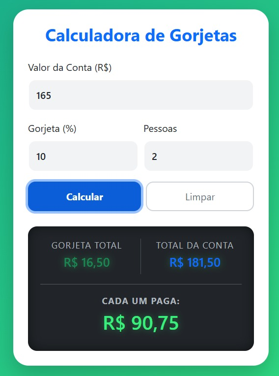

# 💰 Tip Calculator & Bill Splitter

> Uma calculadora de gorjetas e divisão de contas moderna, responsiva e intuitiva. Este projeto foi desenvolvido para praticar manipulação do DOM, lógica de programação com JavaScript e design responsivo com Bootstrap 5.

---
## 📸 Preview

---

## 🚀 Funcionalidades

- **Cálculo Automático:** Calcula o valor da gorjeta e o total final.
- **Divisão de Conta:** Divide o valor total igualmente entre o número de pessoas selecionado.
- **Formatação de Moeda:** Exibição automática no padrão brasileiro (R$).
- **Validação de Inputs:** Impede cálculos com valores vazios ou números de pessoas inválidos.
- **Botão Limpar:** Reseta rapidamente a calculadora para novos cálculos.
- **Design Responsivo:** Layout adaptável para desktop e mobile usando Bootstrap Grid.

---

🔗 [Clique aqui para acessar o projeto online](LINK_MEU_PROJETO)